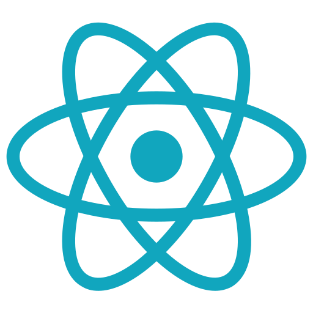
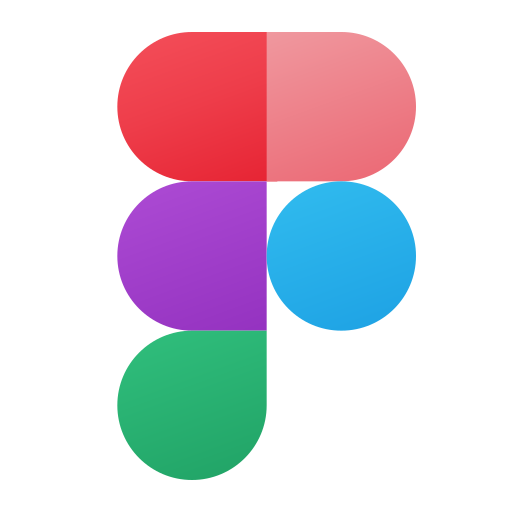

## **Hi there 👋. Nice to see you!**

### **About me:**
I am **Suraj Giri**, an inquisitive and enthusiastic individual with a strong passion for Machine Learning and Software Engienering.

### **Languages and Tools I mostly use:**

f

<a align="center" href="https://www.linkedin.com/in/surajgiri7/">
LinkedIn
</a>||
<a align="center" href="https://www.girisuraj.com.np">
Website
</a> 

## Have a nice day! 😊

<!--
**surajgiri7/surajgiri7** is a ✨ _special_ ✨ repository because its `README.md` (this file) appears on your GitHub profile.

Here are some ideas to get you started:

- 🔭 I’m currently working on ...
- 🌱 I’m currently learning ...
- 👯 I’m looking to collaborate on ...
- 🤔 I’m looking for help with ...
- 💬 Ask me about ...
- 📫 How to reach me: ...
- 😄 Pronouns: ...
- ⚡ Fun fact: ...
-->
